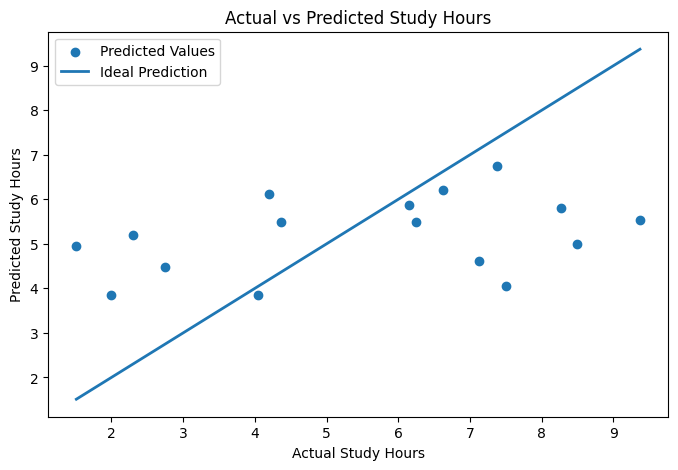

# GoalPilot AI v0.1

An end-to-end Machine Learning project that predicts a student's **next-day study hours** using historical learning behavior.

The project demonstrates the complete ML workflow, from data preprocessing and feature engineering to model evaluation, future prediction, and model persistence.

---

## Problem Statement

Students often struggle to estimate their future study consistency.

GoalPilot AI analyzes historical learning behavior and predicts the expected study hours for the next day, helping mentors and students make data-driven learning decisions.

---

## Project Workflow

- Data Cleaning
- Exploratory Data Analysis (EDA)
- Feature Engineering
- Data Preprocessing
- Linear Regression
- Random Forest
- Hyperparameter Tuning
- XGBoost
- Model Comparison
- Future Prediction
- Model Persistence

---

## Project Preview

### Actual vs Predicted Study Hours



---

## Technologies Used

- Python
- Pandas
- NumPy
- Matplotlib
- Scikit-learn
- XGBoost
- Joblib
- Google Colab

---

## Repository Structure

```text
GoalPilot-AI/
│
├── notebooks/
│   └── GoalPilot_AI_End_to_End_ML_Project.ipynb
│
├── README.md
├── requirements.txt
├── .gitignore
└── LICENSE
```

---

## Models Evaluated

- Linear Regression ✅ (Selected Baseline Model)
- Random Forest
- XGBoost

---

## Future Scope

- Google Sheets Integration
- FastAPI Backend
- React Frontend
- Streamlit Dashboard
- Automated Feature Engineering
- Personalized Study Recommendations

---

## Author

**Priyal Sagar**
